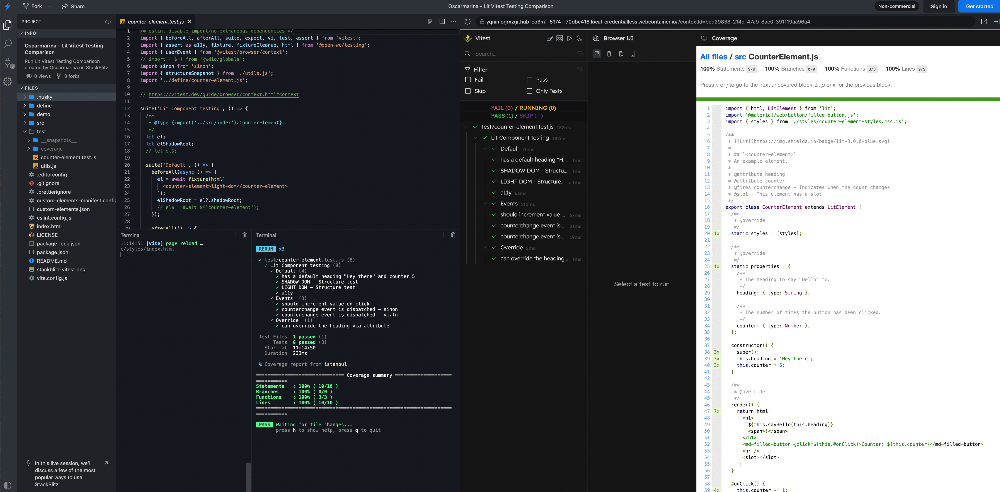

# Testing Lit with Vitest Browser and Playwright

## Introduction

This guide aims to outline the process of migrating from using Web Test Runner to Vitest Browser for testing web components created with Lit. For more details on browser mode, visit the [Vitest guide](https://vitest.dev/guide/browser.html#browser-mode-experimental).

This change arises from a curiosity to explore what the more popular and widely adopted options in the open-source world have to offer, such as Vite and now Vitest.

It's interesting to see how this 2.0 version of Vitest Browser draws inspiration from many other tools, including Web Test Runner itself.

- [Vitest Browser - Discussions](https://github.com/vitest-dev/vitest/discussions/5828)
- [Vitest Browser - Context module](https://github.com/vitest-dev/vitest/pull/5097)

> Although Vitest uses WebDriverIO by default, I have a strong **feeling** that the combination of **Playwright & Vitest** works very well together.

<hr>

[](https://stackblitz.com/github/oscarmarina/lit-vitest-testing-comparison/tree/feature/typescript)

**StackBlitz: open another terminal window and type the command `npm run test`.**


<hr>

#### Using Chai A11y aXe and rollup-plugin-externalize-source-dependencies

The [Chai A11y aXe - open-wc](https://open-wc.org/docs/testing/chai-a11y-axe/#testing-chai-a11y-axe) testing library can be used with Vitest.

```js
test('a11y', async () => {
  await assert.isAccessible(el);
});
```

> However, you'll need to add the following plugin to your Vite configuration:

- Configured via `vite.config.js`
- [rollup-plugin-externalize-source-dependencies](https://github.com/oscarmarina/rollup-plugin-externalize-source-dependencies)

```js
import { defineConfig } from 'vite';
import externalizeSourceDependencies from '@blockquote/rollup-plugin-externalize-source-dependencies';

export default {
  plugins: [
    externalizeSourceDependencies([
      /* @web/test-runner-commands needs to establish a web-socket
       * connection. It expects a file to be served from the
       * @web/dev-server. So it should be ignored by Vite */
      '/__web-dev-server__web-socket.js',
    ]),
  ],
};
```

<hr>

Please note that [axe-core/webdriverio](https://webdriver.io/es/docs/accessibility-testing/axe-core/) is currently incompatible with Vite.

```bash
   Error: Module "url" has been externalized for browser compatibility. Cannot access "url.pathToFileURL" in client code. See [Vite Troubleshooting Guide](https://vitejs.dev/guide/troubleshooting.html#module-externalized-for-browser-compatibility) for more details.
```

#### Using Vitest Snapshots with Semantic-DOM-Diff

`Vitest` also supports [snapshot testing](https://vitest.dev/guide/snapshot.html#use-snapshots)

This setup uses a lightweight simulation of Semantic-DOM-Diff in a `test/utils.js` file.
This allows us to use Vitest's snapshot feature in a way that is more meaningful for testing DOM structures.

```js
test('LIGHT DOM - Structure test', () => {
  expect(structureSnapshot(el, ['id'])).toMatchSnapshot('LIGHT DOM');
});
```

For more details, refer to the [snapshots - semantic-dom-diff](https://open-wc.org/docs/testing/semantic-dom-diff/) documentation.

**Covegare UI**



<hr>

**Scaffold generated using**:

> [npm init @blockquote/wc](https://github.com/oscarmarina/create-wc)
