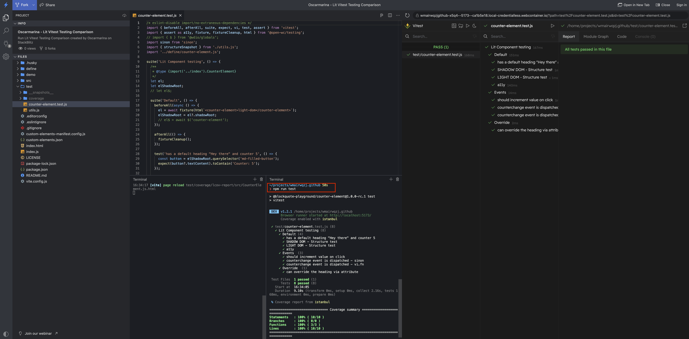

# Testing Lit with Vitest - Browser Mode

This guide provides instructions on how to test a Lit component using Vitest in browser mode.
For more details on browser mode, visit the [Vitest guide](https://vitest.dev/guide/browser.html#browser-mode-experimental).


<br>

[](https://stackblitz.com/github/oscarmarina/lit-vitest-testing-comparison/tree/feature/typescript)

<hr>


<hr>

#### Using Vitest Browser with WebdriverIO

- [Vitest browser using WebdriverIO by default](https://vitest.dev/guide/browser.html#browser-option-types)

#### Using Chai A11y aXe and rollup-plugin-externalize-source-dependencies

Please note that [axe-core/webdriverio](https://www.npmjs.com/package/@axe-core/webdriverio) is currently incompatible with Vite.

```bash
   Error: Module "url" has been externalized for browser compatibility. Cannot access "url.pathToFileURL" in client code. See [Vite Troubleshooting Guide](https://vitejs.dev/guide/troubleshooting.html#module-externalized-for-browser-compatibility) for more details.
```

The [Chai A11y aXe - open-wc](https://open-wc.org/docs/testing/chai-a11y-axe/#testing-chai-a11y-axe) testing library can be used with WebdriverIO.

```js
test('a11y', async () => {
  await assert.isAccessible(el);
});
```

> However, you'll need to add the following plugin to your Vite configuration:

- Configured via `vite.config.js`
- [rollup-plugin-externalize-source-dependencies](https://github.com/oscarmarina/rollup-plugin-externalize-source-dependencies)

```js
import { defineConfig } from 'vite';
import externalizeSourceDependencies from '@blockquote/rollup-plugin-externalize-source-dependencies';

export default {
  plugins: [
    externalizeSourceDependencies([
      /* @web/test-runner-commands needs to establish a web-socket
       * connection. It expects a file to be served from the
       * @web/dev-server. So it should be ignored by Vite */
      '/__web-dev-server__web-socket.js',
    ]),
  ],
};
```

#### Using Vitest Snapshots with Semantic-DOM-Diff

`Vitest` also supports [snapshot testing](https://vitest.dev/guide/snapshot.html#use-snapshots)

This setup uses a lightweight simulation of Semantic-DOM-Diff in a `test/utils.js` file.
This allows us to use Vitest's snapshot feature in a way that is more meaningful for testing DOM structures.

```js
test('LIGHT DOM - Structure test', () => {
  expect(structureSnapshot(el, ['id'])).toMatchSnapshot('LIGHT DOM');
});
```

For more details, refer to the [snapshots - semantic-dom-diff](https://open-wc.org/docs/testing/semantic-dom-diff/) documentation.

**Covegare UI tab**

- [Coverage UI tab issue](https://github.com/vitest-dev/vitest/issues/5013)

<hr>

#### Comparison between Web Test Runner and WebdriverIO

- [lit-testing-comparison](https://github.com/oscarmarina/lit-testing-comparison)

<hr>

**Scaffold generated using**:

> [npm init @blockquote/wc](https://github.com/oscarmarina/create-wc)
