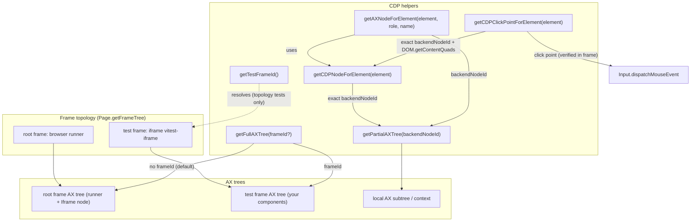

# ARIA + CDP Testing in `counter-element-aria-cdp.test.ts`

This document explains in detail what `test/counter-element-aria-cdp.test.ts`
tests, why it is designed that way, and which technical discoveries (some
unexpected) surfaced while building it.

It is meant for:

- Understanding the **state of the art** of accessibility testing for **Lit**
  and **Shadow DOM** Web Components with Vitest 5 Browser Mode.
- Acting as **living documentation** of the limitations and quirks of the CDP
  (Chrome DevTools Protocol) and of ARIA locators.

---

## 1. Context

### 1.1 What is Vitest Browser Mode?

Vitest 5 can run tests directly in a real browser (Chromium via Playwright by
default). Unlike *jsdom*, here custom elements, Shadow DOM and the browser's
accessibility engine actually work. This allows:

- Using **ARIA locators** (`getByRole`, `getByLabelText`, …) that query the
  browser's **real accessibility tree**.
- Simulating **user interactions** (`userEvent`) that dispatch real pointer and
  keyboard events.
- Talking directly to the browser through the **CDP protocol** with the `cdp()`
  helper from `vitest/browser`.

### 1.2 What is CDP?

CDP (Chrome DevTools Protocol) is the protocol DevTools uses to talk to
Chromium. With `cdp()` from tests you can invoke raw protocol methods, e.g.
`Accessibility.getPartialAXTree`, `DOM.describeNode` or
`Emulation.setEmulatedMedia`. It is a "backdoor" to inspect the accessibility
tree **exactly** as the browser sees it.

### 1.3 Components under test

**`counter-element`** (defined in `src/CounterElement.ts`): a Lit Web
Component that renders an `<h1>`, a material button (`md-filled-button`, itself
another Web Component with its own Shadow DOM) whose text is "Counter: N", an
`<hr aria-hidden="true">` and a `slot` for Light DOM. Click the button and the
counter increments. It is the case study for **two levels of nested Shadow
DOM**: `counter-element` → `md-filled-button` → `<button>`.

**`FocusStepper`** (defined in `src/FocusStepper.ts` and registered via
`src/define/focus-stepper.js`): a self-contained Lit component that exercises
the "ARIA state matrix" we want to query:

- A *disclosure* button with `aria-expanded` that shows/hides a panel and
  moves focus.
- A `role="progressbar"` with `aria-valuemin/max/now/text`, `aria-disabled` and
  `tabindex`, adjustable with the keyboard arrows.
- A second "Complete session" button that increments progress and emits a
  `session-complete` event (bubbling and *composed*).
- A `role="status"` region with `aria-live="polite"`.

---

## 2. File structure

The file has **26 tests** organized in **5 `describe` blocks**:

| Block | Topic |
| ----- | ----- |
| 1. `ARIA locators pierce nested Shadow DOM` | Locating elements across Shadow DOM. |
| 2. `Interactive accessibility state changes` | Tracking accessible state changes. |
| 3. `Real user interactions (userEvent)` | Real pointer and keyboard interactions. |
| 4. `CDP deep dive (Chromium only)` | Deep dive into the CDP protocol. |
| 5. `Accessibility tree snapshots & matching` | ARIA tree snapshots and matching. |

There is also a section of reusable **helpers**:

- `mountCounter` / `mountStepper`: mount each component via `fixture` from
  `@open-wc/testing-helpers`, which awaits the element's `updateComplete`.
  `afterEach(fixtureCleanup)` removes the mounted fixtures after each test.
- `getCDPNodeForElement` / `getAXNodeForElement` / `getFullAXTree` /
  `getPartialAXTree` / `getCDPClickPointForElement`: the key CDP pieces
  (explained in section 6).
- `axFind`, `axProperty`, `axValue`: utilities to navigate the AX tree nodes
  returned by CDP.

---

## 3. Block 1: ARIA locators pierce the Shadow DOM

The tests in this block mount `counter-element` and verify that Vitest's
locating engine can **see inside Shadow Roots**, something impossible with plain
`document.querySelector`.

### `finds the internal <h1> by role, level and accessible name`

```
page.getByRole('heading', {level: 1, name: 'Hello, Hey there!'})
```

The `<h1>` lives inside `counter-element`'s Shadow DOM. The locator finds it by
combining **role + level + accessible name**, and then role, name and text are
verified with the `toHaveRole`, `toHaveAccessibleName` and `toHaveTextContent`
matchers. It demonstrates that role-based lookup relies on the real
accessibility tree, not the HTML.

### `reaches the button two shadow roots deep`

```
page.getByRole('button', {name: 'Counter: 5'})
```

The real button is **two Shadow DOM levels** deep: `counter-element` →
`md-filled-button` → `<button>`. The locator reaches it anyway. We also check it
is enabled (`toBeEnabled`) and that its **accessible name is computed
correctly** from the visible text ("Counter: 5").

### `prunes aria-hidden nodes but keeps composed slotted light DOM`

Two checks on how the accessible tree is composed:

1. **`aria-hidden` is pruned**: the `<hr aria-hidden="true">` is invisible to
   the accessibility tree, so `getByRole('separator').query()` returns `null`.
2. **Slotted Light DOM is composed**: the "light-dom" text we mount as children
   of `<counter-element>` ends up in the tree. We verify it programmatically
   with
   `utils.aria.renderAriaTree(utils.aria.generateAriaTree(el))`, which returns
   the serialized ARIA tree and must contain `- text: light-dom`.

---

## 4. Block 2: Accessible state changes over time

Here `FocusStepper` is mounted and we verify that **the accessibility tree
reacts to reactive-property state changes**.

### `tracks aria-expanded transitions with the expanded filter`

Before clicking, the button is `Show session panel` with `expanded: false`.
After clicking:

- The button is renamed **"Hide session panel"** (the text depends on
  `this.expanded`) and the `expanded: true` filter finds it.
- The collapsed version no longer exists (`query()` → `null`).
- The panel's `progressbar`, previously hidden, is now visible.

This test also reveals an **important quirk**: the button's **name changes with
the state**. It is a legitimate *disclosure* pattern, but worth keeping in mind
when writing tests (a locator for one state does not work for the other).

### `collapses the panel and hides the inner controls again`

It walks the reverse path: click the button again (now "Hide session panel"),
the panel is hidden (`display: none`) and the `progressbar` disappears from the
accessible tree (`query()` → `null`). The button returns to `expanded: false`
and to the name "Show session panel". It covers the **collapse** branch of the
component's `#onToggle` (focus management only runs when expanding).

### `filters by disabled state`

The component is disabled (`el.disabled = true`) and we verify:

- `getByRole('button', {name: 'Complete session', disabled: true})` and
  `getByRole('button', {name: 'Hide session panel', disabled: true})` find the
  **natively disabled** buttons (they have the `disabled` attribute).
- The `disabled: false` variant no longer finds the button (`query()` → `null`).
- The `progressbar` keeps `aria-disabled="true"` as an attribute.

**Important finding**: the `disabled` filter of `getByRole` **does match the
native `disabled` attribute**, but on non-button widgets the filter **ignores
`aria-disabled`**. That is why here we verify the `progressbar` with
`toHaveAttribute('aria-disabled', 'true')` instead of the role filter. (This is
why the `src/FocusStepper.ts` component disables
`lit-a11y/role-supports-aria-attr`: we deliberately use `aria-disabled` on a
`progressbar`.)

### `lets includeHidden find collapsed-but-rendered controls`

When the panel is collapsed, the `progressbar` has `display: none`, so it is
**pruned from the accessible tree**: `getByRole('progressbar')` does not find
it. The `includeHidden: true` option **rescues** it and lets us read its
`aria-valuenow`. Useful for verifying the state of hidden-but-rendered controls.

### `propagates value changes into aria-valuenow and the live region`

Full increment flow:

1. `value = 3` → the `progressbar` has `aria-valuenow="3"` and
   `aria-valuetext="3 of 10 sessions completed"`.
2. The `role="status"` region reflects the same text (a *live* region).
3. Pressing "Complete session" moves everything to `4`: `aria-valuenow="4"` and
   the live region announces "4 of 10 sessions completed".

It verifies that **state propagates from the reactive property to the ARIA
attributes and the live region**.

### `locates the progressbar through its label`

Uses `getByLabelText('Session progress')` to find the `progressbar` by its
`aria-label` and reads its `aria-valuenow`. Complements `getByRole`.

### `reflects counter changes in the accessible name of the material button`

Switches to the material `counter-element` and verifies that the button's
**accessible name** changes with state ("Counter: 5" → "Counter: 6") after a
click. The accessible name is not a static attribute: it is the **text computed
by the accessibility engine**.

---

## 5. Block 3: Real user interactions (`userEvent`)

This block uses `userEvent` from `vitest/browser`, which simulates **real
events** (not artificial dispatches), to validate behavior as a person would.

### `increments with a real pointer click and double click`

- A single click moves the counter from 5 to 6.
- A **double click** moves it from 6 to 8 (two increments). `dblClick` fires two
  real clicks; the component handles each one.

### `activates a focused button with Space and Enter`

A **focus and keyboard management** test:

1. `userEvent.tab()` places focus on the `toggle` button (first in tab order).
   We verify `el.shadowRoot?.activeElement?.id === 'toggle'`.
2. `userEvent.keyboard('{Enter}')` activates the button by keyboard → the panel
   expands.
3. **Focus management**: when expanding, the component moves focus to `complete`
   (the Shadow Root's `activeElement` is checked).
4. `userEvent.keyboard(' ')` (space bar) activates the "Complete session" button
   → `aria-valuenow="4"`.

Note: `toHaveFocus` does not work well with internal Shadow DOM elements
(`document.activeElement` is the *host*, not the inner button), so we check
`shadowRoot.activeElement` directly. Another project finding.

### `supports arrow-key adjustment on the focused progressbar`

1. After expanding, focus is on "Complete session".
2. `userEvent.keyboard('{Shift>}{Tab}{/Shift}')` (Shift+Tab) moves focus to the
   `progressbar`.
3. `userEvent.keyboard('{ArrowRight}')` increments the value to 4 via the
   component's `keydown` handler (`#onMeterKeydown`).
4. `{ArrowLeft}` decrements it back to 3 (always within the `0..max` range).
5. An unrelated key (`a`) is ignored: the value does not change. The handler
   only reacts to `ArrowRight`/`ArrowLeft`.

### `applies and releases real pointer hover state`

`userEvent.hover` / `userEvent.unhover` apply a **real pointer hover**, verified
with `element().matches(':hover')` (first `false`, then `true`, then `false`
again). It is the basis for testing CSS `:hover` effects or tooltips.

---

## 6. Block 4: CDP deep dive (`cdp()`)

This is the most interesting block. We talk **directly to Chromium** at the
protocol level to audit the accessibility tree "first hand".

### The underlying problem (key finding)

We discovered that **the `cdp()` session attaches to the "orchestrator" page**,
not to the iframe where the test runs. The frames are **same-origin**, but each
frame keeps its own AX tree. That is why:

- `Accessibility.getFullAXTree` **without `frameId`** returns **only the root
  frame's tree**: the runner's `RootWebArea` plus the test iframe as a single
  `Iframe` node **without children** (`childIds: []`).
- `Accessibility.queryAXTree` searches the root frame's subtree only.
- `DOMSnapshot.captureSnapshot` does not expose any *aria snapshot* field.

In other words: **document-level AX calls default to the root frame**; the test
iframe must be targeted explicitly via its `frameId`.

### The fix: target the test frame's `frameId`

`Accessibility.getFullAXTree` accepts a `frameId`. Resolve the test iframe with
`Page.getFrameTree` and pass it:

```ts
const {frameTree} = await client.send('Page.getFrameTree');
// the test runs in <iframe name="vitest-iframe">
const frameId = frameTree.childFrames[0].frame.id;
const {nodes} = await client.send('Accessibility.getFullAXTree', {frameId});
```

This returns the **full AX tree of the test iframe** (`RootWebArea` "Vitest
Browser Tester" + your components). The `getFullAXTree(frameId?)` helper in the
test wraps this lookup: call it **without** a `frameId` to get the root frame's
tree, **with** the test frame's `frameId` to get the iframe's. `DOM.getNodeForLocation`
also reports the `frameId` of the node it resolves, which is handy when you
only have coordinates.

### Node identity vs. coordinates: `getCDPNodeForElement` + `getPartialAXTree` (CDP's "eye")

A recurring trap: `DOM.getNodeForLocation()` is a **hit-test**, not an element
resolver. With nested Shadow DOM and component overlays, the node under the
pointer can be a *touch target* or another element above the one the test
selected. So for a **specific element's live AX node** we do **not** anchor on
coordinates: we resolve the exact DOM element to its CDP `backendNodeId` and use
that as the anchor for `getPartialAXTree`. Element resolution and AX pull are
two separate helpers:

```ts
async function getCDPNodeForElement(element) {
  // 1. attach a temporary unique marker to the exact element
  // 2. Page.getFrameTree -> one isolated world per frame
  // 3. Runtime.evaluate: recursive querySelector that pierces open shadow roots
  // 4. DOM.describeNode({objectId}) -> {backendNodeId, frameId}
}

async function getPartialAXTree(backendNodeId) {
  const {nodes} = await client.send('Accessibility.getPartialAXTree', {
    backendNodeId,
    fetchRelatives: true,
  });
  return nodes;
}

async function getAXNodeForElement(element, role, name) {
  const {backendNodeId} = await getCDPNodeForElement(element);
  return axFind(await getPartialAXTree(backendNodeId), role, name);
}
```

This returns the role, the computed accessible name, the properties
(`focusable`, `valuemin`, …) and, for widgets, the **current value**. It is the
real accessibility tree, independent of the DOM we read from the test.

### Helper architecture



- `getTestFrameId()` is confined to the topology/infrastructure tests (dashed
  edge); functional tests resolve the `frameId` from the actual target element.
- `getCDPNodeForElement` is the functional entry point: it returns the exact
  element's `backendNodeId` (+ owning `frameId`), independent of geometry or the
  `vitest-iframe` name.
- `getAXNodeForElement` composes resolution + AX pull: exact element → live AX
  node by role and accessible name.
- `getCDPClickPointForElement` turns the exact node into protocol click
  coordinates via `DOM.getContentQuads()`, translates from iframe to root-page
  coordinates (via `DOM.querySelector('iframe[data-vitest="true"]')` +
  `DOM.getBoxModel`), and uses a `requestAnimationFrame` wait to prevent empty
  quads when `trace: 'on'` is active.
- `getFullAXTree(frameId?)` makes the default-root vs. explicit-frame
  distinction explicit.

### The block's tests

**`audits the live progressbar AX node and its valuenow over time`**

- Resolves the exact `progressbar` element with `getAXNodeForElement` and audits
  its live AX node (`getCDPNodeForElement` → `getPartialAXTree` → `axFind`),
  verifying name, value, `valuemax` and `focusable`.
- **AX schema finding**: a `progressbar`'s current value is NOT in
  `properties.valuenow` (it does not even exist): it lives in the node's
  top-level **`value`** field. `valuemin`, `valuemax` and `focusable` do live in
  `properties`. That is why the `axValue()` helper reads `node.value?.value`.
- After pressing "Complete session" we **re-query the AX tree** and confirm the
  browser updated its AX cache to `4`, independently of our DOM read. It proves
  **the browser's AX cache is the authoritative source**.

**`audits the live accessible name of the material button`**

- Repeats the pattern on `counter-element`: resolves the exact material button
  (two Shadow DOMs deep) with `getAXNodeForElement` and verifies its **computed
  accessible name** is "Counter: 5".
- After a real click, the new AX node returns "Counter: 6". The accessible name
  Chromium computes **matches Vitest's locator**.

**`discovers the browser frame hierarchy (root runner + test iframe)`**

- Calls `Page.getFrameTree` and asserts stable topology: a root frame plus at
  least one child frame, and the test document lives in a frame different from
  the root.
- Documents the current Vitest Browser Mode topology: the test iframe is named
  `vitest-iframe`. Observed behavior, not a hard dependency of the functional
  tests (which derive the `frameId` from the actual target element).

**`reaches the test AX tree via Accessibility.getFullAXTree({frameId})`**

- Confirms the F2 finding: `getFullAXTree` **without `frameId`** returns the root
  frame's tree — the runner's `RootWebArea` plus an `Iframe` node, **without the
  test's content** ("Counter: 5" is absent).
- Then passes the test frame's `frameId` (via `getFullAXTree(await getTestFrameId())`)
  and gets the iframe's own AX tree, which **does** contain our content: the
  material button's computed name is "Counter: 5".

**`pierces nested shadow roots in the DOM domain snapshot`**

- With `DOM.getFlattenedDocument({depth: -1, pierce: true})` we get the flattened
  DOM tree **piercing the Shadow Roots**: the `counter-element` node exposes
  `shadowRoots`, and inside it is the `md-filled-button` host, which exposes its
  own `shadowRoots`.
- **Finding**: `DOM.getNodeForLocation` on the button does not return the
  `<button>` but a Material *touch target* `<span>`. The robust way to resolve
  the real button is `DOM.querySelector` **rooted at the Shadow Root's
  `nodeId`**:

  ```ts
  const {nodeId} = await client.send('DOM.querySelector', {
    nodeId: materialShadowRoot.nodeId,
    selector: 'button',
  });
  ```

- `DOM.describeNode({nodeId})` confirms the resolved node is a `<button>`.
  In other words: CDP's `querySelector` only pierces Shadow DOM when the root is
  the Shadow Root itself.

**`drives a real pointer click with raw Input.dispatchMouseEvent`**

- The click coordinates come from **CDP geometry**, not from
  `getBoundingClientRect()`: `getCDPClickPointForElement` resolves the exact
  button (`getCDPNodeForElement`), waits one `requestAnimationFrame` (to
  stabilise the render pipeline when `trace: 'on'` is active), reads the
  element's quad with `DOM.getContentQuads()`, and translates from iframe to
  root-page coordinates (via `DOM.querySelector('iframe[data-vitest="true"]')` +
  `DOM.getBoxModel`).
- We dispatch `mouseMoved`, `mousePressed` and `mouseReleased` with
  `Input.dispatchMouseEvent` (the exact sequence a real click generates at the
  system level).
- The test asserts the complete browser event sequence (`pointerdown` →
  `mousedown` → `pointerup` → `mouseup` → `click`) and that the counter moved to
  6. **At the protocol level, without touching the DOM**, we can click.

**`emulates prefers-reduced-motion and forced-colors at the protocol level`**

- With `Emulation.setEmulatedMedia` we enable `prefers-reduced-motion: reduce`
  and `forced-colors: active`.
- We verify with `matchMedia(...)` that the value changes to `true`, and after
  restoring the state (`features: []`) it returns to `false`.
- This lets us test `@media (prefers-reduced-motion)` styles and high-contrast
  themes without touching browser configuration.

**`dispatches a composed event whose detail matches the CDP-observed value`**

- We spy on `dispatchEvent` with `vi.spyOn` and check that the component emits
  `session-complete` with `detail: 4` (the value after completing). It unifies
  the real interaction (`userEvent`) with the event-contract verification.

---

## 7. Block 5: ARIA tree snapshots and matching

### `exposes the composed ARIA tree as an inline snapshot`

Uses `page.elementLocator(el)` + `toMatchAriaInlineSnapshot` to compare the
component's full ARIA tree against a literal snapshot:

```yaml
- button "Hide session panel" [expanded]
- heading "Session progress" [level=2]
- progressbar "Session progress"
- button "Complete session"
- status
```

Any change in roles, names or accessible states **breaks the snapshot**: an
excellent safety net for component refactors.

### `renders the ARIA tree programmatically and tracks updates`

Generates the tree with `utils.aria.generateAriaTree(el)` and serializes it with
`utils.aria.renderAriaTree(...)`. Verifies it contains the `progressbar`, the
`status` and the text "3 of 10 sessions completed", and that after completing a
session it reflects "4 of 10 sessions completed". A programmatic (matcher-free)
version of the snapshot.

### `keeps matcher-computed and CDP-computed accessible names in sync`

Closes the loop: the accessible name **Vitest's matcher** computes ("Counter: 5")
must match the one **CDP computes directly** for the exact element's live AX node
(`getAXNodeForElement` → `getCDPNodeForElement` + `getPartialAXTree` →
`axFind(..., 'button')?.name?.value`), before and after the click. If the two
sources diverged, we would have a reliability problem in the locator layer.

---

## 8. Summary of technical findings

| Finding | Where it is documented |
| -------- | ------------------ |
| `cdp()` attaches to the orchestrator page; the test iframe has its own AX tree, reachable via its `frameId`. | Section 6, `getFullAXTree({frameId})` test |
| `Accessibility.getFullAXTree` / `queryAXTree` without `frameId` only reach the root frame; pass the test frame's `frameId` to see the iframe content. | Section 6 |
| `Page.getFrameTree` + `Accessibility.getFullAXTree({frameId})` return the test iframe's full AX tree. | `getFullAXTree` helper |
| `DOM.getNodeForLocation` is a **hit-test**, not an element resolver; resolve the exact element to its `backendNodeId` instead. | `getCDPNodeForElement` helper |
| Exact `backendNodeId` + `Accessibility.getPartialAXTree` give the "live" AX node of any element. | `getAXNodeForElement`/`getPartialAXTree` helpers |
| A `progressbar`'s value is in `node.value`, not in `properties.valuenow`. | `valuenow over time` test |
| The `disabled` filter of `getByRole` ignores `aria-disabled` on non-button widgets. | `filters by disabled state` test |
| `DOM.querySelector` pierces Shadow DOM only when rooted at the Shadow Root's `nodeId`. | `DOM domain snapshot` test |
| `DOM.getNodeForLocation` can resolve Material's *touch target* instead of the `<button>`. | `DOM domain snapshot` test |
| `toHaveFocus` is unreliable for internal Shadow DOM elements; use `shadowRoot.activeElement`. | Space/Enter test |
| `Emulation.setEmulatedMedia` affects `matchMedia` in real time. | `prefers-reduced-motion` test |
| `Input.dispatchMouseEvent` clicks real elements when the coordinates come from `DOM.getContentQuads()` (CDP geometry). | `getCDPClickPointForElement` + `dispatchMouseEvent` test |
| ARIA locators pierce nested Shadow DOM with no extra configuration. | Block 1 |

---

## 9. How to run

```bash
# Only this file
npx vitest run test/counter-element-aria-cdp.test.ts

# Whole project (includes the original counter-element suite)
npx vitest run

# Watch mode during development
npx vitest

# Headed browser (raw pointer/interaction tests are most stable this way)
npx vitest --browser.headless=false
```

Requires the project installed with `@vitest/browser` and Playwright (Chromium).
The tests depend on Chromium; some CDP capabilities (e.g. `Input` and
`Emulation`) are Chromium-specific.

---

## 10. Possible extensions or "toys"

Ideas that could grow from this work:

1. **Accessibility regression matrix**: query the AX node after every interaction
   and compare `role + name + focusable + disabled` against a golden JSON per
   state.
2. **Custom matcher** `toHaveLiveAXNode`: wrap `getCDPNodeForElement` +
   `getPartialAXTree` in an `expect` extension so the team can write
   `expect(el).toHaveLiveAXNode({role: 'progressbar', value: 4})`.
3. **`prefers-reduced-motion` harness**: a helper that enables/restores media
   emulation to verify components drop animations and contrast in
   `forced-colors`.
4. **Pointer fuzzer**: use `DOM.getNodeForLocation` on random points to detect
   "dead zones" where an overlaid *touch target* swallows clicks meant for a
   real control.
5. **AX bridge between frames**: a generic helper that resolves the test
   frame's `frameId` (`getFullAXTree`) plus a targeted
   `getCDPNodeForElement`/`getPartialAXTree` that serve as the CDP abstraction
   layer for the rest of the team.
