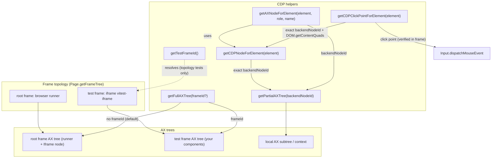

# Pruebas ARIA + CDP en `counter-element-aria-cdp.test.ts`

Este documento explica en detalle qué se prueba en el archivo
`test/counter-element-aria-cdp.test.ts`, por qué está diseñado así y qué
descubrimientos técnicos (algunos inesperados) salieron a la luz durante su
desarrollo.

Está pensado para:

- Entender el **estado del arte** de las pruebas de accesibilidad para Web
  Components basados en **Lit** y **Shadow DOM** con Vitest 5 Browser Mode.
- Actuar como **documentación viva** de las limitaciones y peculiaridades del
  protocolo CDP (Chrome DevTools Protocol) y de los locators de ARIA.

---

## 1. Contexto

### 1.1 ¿Qué es Vitest Browser Mode?

Vitest 5 puede ejecutar los tests directamente en un navegador real (por defecto
Chromium vía Playwright). A diferencia del modo *jsdom*, aquí los custom
elements, el Shadow DOM y el motor de accesibilidad del navegador funcionan de
verdad. Esto permite:

- Usar **locators de ARIA** (`getByRole`, `getByLabelText`, …) que consultan el
  **árbol de accesibilidad real** del navegador.
- Simular **interacciones de usuario** (`userEvent`) que disparan eventos de
  puntero y teclado reales.
- Hablar directamente con el navegador a través del **Protocolo CDP** con el
  helper `cdp()` de `vitest/browser`.

### 1.2 ¿Qué es CDP?

CDP (Chrome DevTools Protocol) es el protocolo que usa DevTools para hablar con
Chromium. Con `cdp()` desde los tests se pueden invocar métodos crudos del
protocolo, por ejemplo `Accessibility.getPartialAXTree`, `DOM.describeNode` o
`Emulation.setEmulatedMedia`. Es una "puerta trasera" para inspeccionar el
árbol de accesibilidad **exactamente** como lo ve el navegador.

### 1.3 Componentes bajo prueba

**`counter-element`** (definido en `src/CounterElement.ts`): un Web Component
Lit que muestra un `<h1>`, un botón de material (`md-filled-button`, que a su
vez es otro Web Component con su propio Shadow DOM) cuyo texto es
"Counter: N", un `<hr aria-hidden="true">` y un `slot` para Light DOM. Pulsa el
botón y el contador incrementa. Es el caso de estudio de **Shadow DOM
anidado a dos niveles**: `counter-element` → `md-filled-button` → `<button>`.

**`FocusStepper`** (definido en `src/FocusStepper.ts` y registrado vía
`src/define/focus-stepper.js`): un componente Lit autónomo que ejercita la
"matriz de estados ARIA" que queremos consultar:

- Un botón *disclosure* con `aria-expanded` que muestra/oculta un panel y
  mueve el foco.
- Un `role="progressbar"` con `aria-valuemin/max/now/text`, `aria-disabled` y
  `tabindex`, ajustable con las flechas del teclado.
- Un segundo botón "Complete session" que incrementa el progreso y emite un
  evento `session-complete` (burbujeante y *composed*).
- Una región `role="status"` con `aria-live="polite"`.

---

## 2. Estructura del archivo

El archivo tiene **26 tests** organizados en **5 bloques `describe`**:

| Bloque | Tema |
| ------ | ---- |
| 1. `ARIA locators pierce nested Shadow DOM` | Localización de elementos a través del Shadow DOM. |
| 2. `Interactive accessibility state changes` | Seguimiento de cambios de estado accesible. |
| 3. `Real user interactions (userEvent)` | Interacciones reales de puntero y teclado. |
| 4. `CDP deep dive (Chromium only)` | Inmersión en el protocolo CDP. |
| 5. `Accessibility tree snapshots & matching` | Snapshots y comparación de árboles ARIA. |

Además hay una sección de **helpers** reutilizables:

- `mountCounter` / `mountStepper`: montan cada componente mediante `fixture` de
  `@open-wc/testing-helpers`, que espera el `updateComplete` del elemento.
  `afterEach(fixtureCleanup)` elimina los fixtures montados tras cada test.
- `getCDPNodeForElement` / `getAXNodeForElement` / `getFullAXTree` /
  `getPartialAXTree` / `getCDPClickPointForElement`: las piezas clave de CDP (se
  explican en la sección 6).
- `axFind`, `axProperty`, `axValue`: utilidades para navegar los nodos del
  árbol AX devuelto por CDP.

---

## 3. Bloque 1: Los locators ARIA atraviesan el Shadow DOM

Los tests de este bloque montan `counter-element` y comprueban que el motor de
localización de Vitest es capaz de **ver dentro de los Shadow Roots**, algo
imposible con `document.querySelector` normal.

### `finds the internal <h1> by role, level and accessible name`

```
page.getByRole('heading', {level: 1, name: 'Hello, Hey there!'})
```

El `<h1>` vive dentro del Shadow DOM de `counter-element`. El locator lo
encuentra combinando **rol + nivel + nombre accesible** y después se verifican
rol, nombre y texto con los matchers `toHaveRole`, `toHaveAccessibleName` y
`toHaveTextContent`. Demuestra que la búsqueda por rol se basa en el árbol de
accesibilidad real, no en el HTML.

### `reaches the button two shadow roots deep`

```
page.getByRole('button', {name: 'Counter: 5'})
```

El botón real está **dos niveles de Shadow DOM** dentro: `counter-element` →
`md-filled-button` → `<button>`. El locator lo alcanza igualmente. Además
comprobamos que está habilitado (`toBeEnabled`) y que su **nombre accesible se
computa correctamente** a partir del texto visible ("Counter: 5").

### `prunes aria-hidden nodes but keeps composed slotted light DOM`

Dos comprobaciones sobre cómo se compone el árbol accesible:

1. **`aria-hidden` se poda**: el `<hr aria-hidden="true">` es invisible para el
   árbol de accesibilidad, así que `getByRole('separator').query()` devuelve
   `null`.
2. **El Light DOM con `slot` se compone**: el texto "light-dom" que montamos
   como children de `<counter-element>` acaba en el árbol. Lo verificamos
   programáticamente con `utils.aria.renderAriaTree(utils.aria.generateAriaTree(el))`,
   que devuelve el árbol ARIA serializado y debe contener `- text: light-dom`.

---

## 4. Bloque 2: Cambios de estado accesible en el tiempo

Aquí se monta `FocusStepper` y se comprueba que **el árbol de accesibilidad
reacciona a los cambios de estado** de la propiedad reactiva.

### `tracks aria-expanded transitions with the expanded filter`

Antes de hacer clic el botón es `Show session panel` con `expanded: false`.
Tras hacer clic:

- El botón pasa a llamarse **"Hide session panel"** (el texto depende de
  `this.expanded`) y el filtro `expanded: true` lo encuentra.
- La versión colapsada ya no existe (`query()` → `null`).
- El `progressbar` del panel, antes oculto, ahora es visible.

Este test también deja ver una **peculiaridad importante**: el nombre del botón
**cambia con el estado**. Es un patrón legítimo de *disclosure*, pero conviene
tenerlo en cuenta al escribir tests (el locator de un estado no vale para el
otro).

### `collapses the panel and hides the inner controls again`

Recorre el camino inverso: vuelve a hacer clic en el botón (ahora "Hide session
panel"), el panel se oculta (`display: none`) y el `progressbar` desaparece del
árbol accesible (`query()` → `null`). El botón recupera `expanded: false` y el
nombre "Show session panel". Cubre la rama de **colapso** del `#onToggle` del
componente (la gestión de foco solo se ejecuta al expandir).

### `filters by disabled state`

Se desactiva el componente (`el.disabled = true`) y se comprueba:

- `getByRole('button', {name: 'Complete session', disabled: true})` y
  `getByRole('button', {name: 'Hide session panel', disabled: true})` encuentran
  los botones **nativamente deshabilitados** (tienen el atributo `disabled`).
- La variante `disabled: false` ya no encuentra el botón (`query()` → `null`).
- El `progressbar` conserva `aria-disabled="true"` como atributo.

**Hallazgo importante**: el filtro `disabled` de `getByRole` **sí coincide con
el atributo nativo `disabled`**, pero en widgets no-botón el filtro **ignora
`aria-disabled`**. Por eso aquí verificamos el `progressbar` con
`toHaveAttribute('aria-disabled', 'true')` en lugar del filtro de rol. (Por eso
el componente `src/FocusStepper.ts` desactiva `lit-a11y/role-supports-aria-attr`:
usamos `aria-disabled` en un `progressbar` de forma deliberada.)

### `lets includeHidden find collapsed-but-rendered controls`

Cuando el panel está colapsado, el `progressbar` tiene `display: none`, por lo
que se **poda del árbol accesible**: `getByRole('progressbar')` no lo encuentra.
La opción `includeHidden: true` lo **rescata** y permite leer su `aria-valuenow`.
Útil para verificar estado de controles ocultos pero renderizados.

### `propagates value changes into aria-valuenow and the live region`

Flujo completo de un incremento:

1. `value = 3` → el `progressbar` tiene `aria-valuenow="3"` y
   `aria-valuetext="3 of 10 sessions completed"`.
2. La región `role="status"` refleja el mismo texto (región *live*).
3. Al pulsar "Complete session", todo pasa a `4`: `aria-valuenow="4"` y la
   región live anuncia "4 of 10 sessions completed".

Comprueba que **el estado se propaga desde la propiedad reactiva hasta los
atributos ARIA y la región live**.

### `locates the progressbar through its label`

Usa `getByLabelText('Session progress')` para encontrar el `progressbar` por su
`aria-label` y lee su `aria-valuenow`. Complementa a `getByRole`.

### `reflects counter changes in the accessible name of the material button`

Intercambia al `counter-element` de material y verifica que el **nombre
accesible** del botón cambia con el estado ("Counter: 5" → "Counter: 6")
después de hacer clic. El nombre accesible no es un atributo estático: es el
**texto computado por el motor de accesibilidad**.

---

## 5. Bloque 3: Interacciones reales de usuario (`userEvent`)

Este bloque usa `userEvent` de `vitest/browser`, que simula **eventos reales**
(no dispatches artificiales), para validar comportamiento como lo haría una
persona.

### `increments with a real pointer click and double click`

- Un clic pasa el contador de 5 a 6.
- Un **doble clic** lo pasa de 6 a 8 (dos incrementos). `dblClick` dispara dos
  clicks reales; el componente maneja cada uno.

### `activates a focused button with Space and Enter`

Prueba de **gestión de foco y teclado**:

1. `userEvent.tab()` sitúa el foco en el botón `toggle` (primero en el orden de
   tabulación). Verificamos `el.shadowRoot?.activeElement?.id === 'toggle'`.
2. `userEvent.keyboard('{Enter}')` activa el botón por teclado → el panel se
   expande.
3. **Gestión de foco**: al expandirse, el componente mueve el foco a
   `complete` (se verifica el `activeElement` del Shadow Root).
4. `userEvent.keyboard(' ')` (barra espaciadora) activa el botón "Complete
   session" → `aria-valuenow="4"`.

Nota: `toHaveFocus` no funciona bien con elementos internos del Shadow DOM
(el `document.activeElement` es el *host*, no el botón interior), así que
verificamos `shadowRoot.activeElement` directamente. Otro de los hallazgos del
proyecto.

### `supports arrow-key adjustment on the focused progressbar`

1. Tras expandir, el foco está en "Complete session".
2. `userEvent.keyboard('{Shift>}{Tab}{/Shift}')` (Shift+Tab) mueve el foco al
   `progressbar`.
3. `userEvent.keyboard('{ArrowRight}')` incrementa el valor a 4 vía el handler
   `keydown` del componente (`#onMeterKeydown`).
4. `{ArrowLeft}` lo decrementa de nuevo a 3 (siempre dentro del rango `0..max`).
5. Una tecla no relacionada (`a`) se ignora: el valor no cambia. El handler solo
   reacciona a `ArrowRight`/`ArrowLeft`.

### `applies and releases real pointer hover state`

`userEvent.hover` / `userEvent.unhover` aplican un **hover real de puntero**, y
lo verificamos con `element().matches(':hover')` (que antes era `false`, luego
`true`, y vuelve a `false`). Es la base para testear efectos `:hover` de CSS o
tooltips.

---

## 6. Bloque 4: Inmersión en CDP (`cdp()`)

Este es el bloque más interesante. Hablamos **directamente con Chromium** a
nivel de protocolo para auditar el árbol de accesibilidad "de primera mano".

### El problema de fondo (hallazgo clave)

Descubrimos que **la sesión `cdp()` se adjunta a la página "orquestadora"
(orchestrator)**, no al iframe donde corre el test. Los frames son
**mismo-origen**, pero cada frame mantiene su propio árbol AX. Por eso:

- `Accessibility.getFullAXTree` **sin `frameId`** devuelve **solo el árbol del
  frame raíz**: el `RootWebArea` del runner más el iframe del test como un único
  nodo `Iframe` **sin hijos** (`childIds: []`).
- `Accessibility.queryAXTree` solo busca en el subtree del frame raíz.
- `DOMSnapshot.captureSnapshot` no expone ningún campo de *aria snapshot*.

Es decir: **las llamadas AX de nivel documento caen por defecto al frame raíz**;
el iframe del test debe apuntarse explícitamente vía su `frameId`.

### El arreglo: apunta al `frameId` del frame del test

`Accessibility.getFullAXTree` acepta un `frameId`. Resuelve el iframe del test
con `Page.getFrameTree` y pásalo:

```ts
const {frameTree} = await client.send('Page.getFrameTree');
// el test corre en <iframe name="vitest-iframe">
const frameId = frameTree.childFrames[0].frame.id;
const {nodes} = await client.send('Accessibility.getFullAXTree', {frameId});
```

Esto devuelve el **árbol AX completo del iframe del test** (`RootWebArea`
"Vitest Browser Tester" + tus componentes). El helper `getFullAXTree(frameId?)`
del test envuelve esta búsqueda: llámalo **sin** `frameId` para obtener el árbol
del frame raíz, **con** el `frameId` del frame del test para obtener el del
iframe. `DOM.getNodeForLocation` también informa del `frameId` del nodo que
resuelve, útil cuando solo tienes coordenadas.

### Identidad de nodo vs. coordenadas: `getCDPNodeForElement` + `getPartialAXTree` (el "ojo" de CDP)

Una trampa recurrente: `DOM.getNodeForLocation()` es un **hit-test**, no un
resolutor de elementos. Con Shadow DOM anidado y overlays de componentes, el nodo
bajo el puntero puede ser un *touch target* u otro elemento por encima del que el
test seleccionó. Así que para el **nodo AX vivo de un elemento concreto** NO nos
anclamos en coordenadas: resolvemos el elemento DOM exacto a su `backendNodeId`
CDP y lo usamos como ancla de `getPartialAXTree`. La resolución del elemento y la
extracción AX son dos helpers separados:

```ts
async function getCDPNodeForElement(element) {
  // 1. marca única temporal sobre el elemento exacto
  // 2. Page.getFrameTree -> un isolated world por frame
  // 3. Runtime.evaluate: querySelector recursivo que perfora shadow roots abiertos
  // 4. DOM.describeNode({objectId}) -> {backendNodeId, frameId}
}

async function getPartialAXTree(backendNodeId) {
  const {nodes} = await client.send('Accessibility.getPartialAXTree', {
    backendNodeId,
    fetchRelatives: true,
  });
  return nodes;
}

async function getAXNodeForElement(element, role, name) {
  const {backendNodeId} = await getCDPNodeForElement(element);
  return axFind(await getPartialAXTree(backendNodeId), role, name);
}
```

Esto devuelve el rol, el nombre accesible computado, las propiedades
(`focusable`, `valuemin`, …) y, para widgets, el **valor actual**. Es el árbol
de accesibilidad real, independiente del DOM que leemos desde el test.

### Arquitectura de helpers



- `getTestFrameId()` queda confinado a los tests de topología/infraestructura
  (arista punteada); los tests funcionales resuelven el `frameId` desde el
  propio elemento objetivo.
- `getCDPNodeForElement` es el punto de entrada funcional: devuelve el
  `backendNodeId` exacto del elemento (+ el `frameId` que lo posee), de forma
  independiente de la geometría o del nombre `vitest-iframe`.
- `getAXNodeForElement` compone resolución + extracción AX: elemento exacto →
  nodo AX vivo por rol y nombre accesible.
- `getCDPClickPointForElement` convierte el nodo exacto en coordenadas de clic
  de protocolo vía `DOM.getContentQuads()`, traduce del iframe a coordenadas de
  página raíz (vía `DOM.querySelector('iframe[data-vitest="true"]')` +
  `DOM.getBoxModel`), y usa un `requestAnimationFrame` para evitar quads vacíos
  cuando `trace: 'on'` está activo.
- `getFullAXTree(frameId?)` hace explícita la distinción default-raíz vs.
  frame explícito.

### Los tests del bloque

**`audits the live progressbar AX node and its valuenow over time`**

- Resuelve el `progressbar` exacto con `getAXNodeForElement` y audita su nodo AX
  vivo (`getCDPNodeForElement` → `getPartialAXTree` → `axFind`), verificando
  nombre, valor, `valuemax` y `focusable`.
- **Hallazgo del esquema AX**: el valor actual de un `progressbar` NO está en
  `properties.valuenow` (que ni existe): vive en el campo **`value` de nivel
  superior** del nodo AX. En cambio `valuemin`, `valuemax` y `focusable` sí
  están en `properties`. Por eso el helper `axValue()` lee `node.value?.value`.
- Tras pulsar "Complete session" **re-consultamos el árbol AX** y confirmamos
  que el navegador ha actualizado su caché AX a `4`, de forma independiente de
  nuestra lectura del DOM. Es la prueba de que **la caché AX del navegador es
  la fuente autoritativa**.

**`audits the live accessible name of the material button`**

- Replica el patrón sobre `counter-element`: resuelve el botón de material exacto
  (dos Shadow DOMs adentro) con `getAXNodeForElement` y verifica que su
  **nombre accesible computado** es "Counter: 5".
- Tras un clic real, el nuevo nodo AX devuelve "Counter: 6". El nombre
  accesible que computa Chromium **coincide con el locator** de Vitest.

**`discovers the browser frame hierarchy (root runner + test iframe)`**

- Llama a `Page.getFrameTree` y verifica topología estable: un frame raíz más al
  menos un frame hijo, y el documento del test vive en un frame distinto del
  raíz.
- Documenta la topología actual de Vitest Browser Mode: el iframe del test se
  llama `vitest-iframe`. Comportamiento observado, no una dependencia dura de
  los tests funcionales (que derivan el `frameId` del propio elemento objetivo).

**`reaches the test AX tree via Accessibility.getFullAXTree({frameId})`**

- Confirma el hallazgo F2: `getFullAXTree` **sin `frameId`** devuelve el árbol
  del frame raíz — el `RootWebArea` del runner más un nodo `Iframe`, **sin el
  contenido del test** ("Counter: 5" está ausente).
- Después pasa el `frameId` del frame del test (vía
  `getFullAXTree(await getTestFrameId())`) y obtiene el árbol AX propio del
  iframe, que **sí** contiene nuestro contenido: el nombre computado del botón
  de material es "Counter: 5".

**`pierces nested shadow roots in the DOM domain snapshot`**

- Con `DOM.getFlattenedDocument({depth: -1, pierce: true})` obtenemos el árbol
  DOM aplanado **perforando los Shadow Roots**: el nodo `counter-element`
  expone `shadowRoots`, y dentro está el host `md-filled-button`, que expone su
  propio `shadowRoots`.
- **Hallazgo**: `DOM.getNodeForLocation` sobre el botón no devuelve el
  `<button>`, sino un `<span>` de *touch target* que Material superpone. La
  forma robusta de resolver el botón real es `DOM.querySelector` **con el
  `nodeId` del Shadow Root** como raíz:

  ```ts
  const {nodeId} = await client.send('DOM.querySelector', {
    nodeId: materialShadowRoot.nodeId,
    selector: 'button',
  });
  ```

- `DOM.describeNode({nodeId})` confirma que el nodo resuelto es un `<button>`.
  Es decir: `querySelector` de CDP solo perfora Shadow DOM cuando la raíz es el
  propio Shadow Root.

**`drives a real pointer click with raw Input.dispatchMouseEvent`**

- Las coordenadas del clic vienen de la **geometría CDP**, no de
  `getBoundingClientRect()`: `getCDPClickPointForElement` resuelve el botón
  exacto (`getCDPNodeForElement`), espera un `requestAnimationFrame` (para
  estabilizar el pipeline de render cuando `trace: 'on'` está activo), lee su
  quad con `DOM.getContentQuads()`, y traduce del iframe a coordenadas de
  página raíz (vía `DOM.querySelector('iframe[data-vitest="true"]')` +
  `DOM.getBoxModel`).
- Disparamos `mouseMoved`, `mousePressed` y `mouseReleased` con
  `Input.dispatchMouseEvent` (la secuencia exacta que genera un clic real a
  nivel de sistema).
- El test verifica la secuencia completa de eventos del navegador
  (`pointerdown` → `mousedown` → `pointerup` → `mouseup` → `click`) y que el
  contador pasó a 6. **A nivel de protocolo, sin tocar el DOM**, podemos hacer
  click.

**`emulates prefers-reduced-motion and forced-colors at the protocol level`**

- Con `Emulation.setEmulatedMedia` activamos `prefers-reduced-motion: reduce` y
  `forced-colors: active`.
- Verificamos con `matchMedia(...)` que el valor cambia a `true`, y tras
  restaurar el estado (`features: []`) vuelve a `false`.
- Esto permite probar estilos de `@media (prefers-reduced-motion)` y temas de
  alto contraste sin tocar la configuración del navegador.

**`dispatches a composed event whose detail matches the CDP-observed value`**

- Espiamos `dispatchEvent` con `vi.spyOn` y comprobamos que el componente
  emite `session-complete` con `detail: 4` (el valor tras completar). Unifica
  la interacción real (`userEvent`) con la verificación del contrato de
  eventos.

---

## 7. Bloque 5: Snapshots y comparación de árboles ARIA

### `exposes the composed ARIA tree as an inline snapshot`

Usa `page.elementLocator(el)` + `toMatchAriaInlineSnapshot` para comparar el
árbol ARIA completo del componente con un snapshot literal:

```yaml
- button "Hide session panel" [expanded]
- heading "Session progress" [level=2]
- progressbar "Session progress"
- button "Complete session"
- status
```

Cualquier cambio en roles, nombres o estados accesibles **rompe el snapshot**:
una red de seguridad excelente para refactors de componentes.

### `renders the ARIA tree programmatically and tracks updates`

Genera el árbol con `utils.aria.generateAriaTree(el)` y lo serializa con
`utils.aria.renderAriaTree(...)`. Verifica que contiene el `progressbar`, la
`status` y el texto "3 of 10 sessions completed", y que tras completar una
sesión refleja "4 of 10 sessions completed". Versión programática (sin
matchers) del snapshot.

### `keeps matcher-computed and CDP-computed accessible names in sync`

Cierra el círculo: el nombre accesible que computa el **matcher de Vitest**
("Counter: 5") debe coincidir con el que computa **CDP directamente** para el
nodo AX vivo del elemento exacto (`getAXNodeForElement` → `getCDPNodeForElement`
+ `getPartialAXTree` → `axFind(..., 'button')?.name?.value`), antes y después
del clic. Si las dos fuentes divergieran, tendríamos un problema de fiabilidad
en la capa de locators.

---

## 8. Resumen de hallazgos técnicos

| Hallazgo | Dónde se documenta |
| -------- | ------------------ |
| `cdp()` se adjunta a la página orquestadora; el iframe del test tiene su propio árbol AX, accesible vía su `frameId`. | Sección 6, test `getFullAXTree({frameId})` |
| `Accessibility.getFullAXTree` / `queryAXTree` sin `frameId` solo alcanzan el frame raíz; pasa el `frameId` del frame del test para ver el contenido del iframe. | Sección 6 |
| `Page.getFrameTree` + `Accessibility.getFullAXTree({frameId})` devuelven el árbol AX completo del iframe del test. | Helper `getFullAXTree` |
| `DOM.getNodeForLocation` es un **hit-test**, no un resolutor de elementos; resuelve el elemento exacto a su `backendNodeId`. | Helper `getCDPNodeForElement` |
| `backendNodeId` exacto + `Accessibility.getPartialAXTree` dan el nodo AX "vivo" de cualquier elemento. | Helpers `getAXNodeForElement`/`getPartialAXTree` |
| El valor de un `progressbar` está en `node.value`, no en `properties.valuenow`. | Test `valuenow over time` |
| El filtro `disabled` de `getByRole` ignora `aria-disabled` en widgets no-botón. | Test `filters by disabled state` |
| `DOM.querySelector` perfora Shadow DOM solo cuando la raíz es el `nodeId` del Shadow Root. | Test `DOM domain snapshot` |
| `DOM.getNodeForLocation` puede resolver el *touch target* de Material en lugar del `<button>`. | Test `DOM domain snapshot` |
| `toHaveFocus` es poco fiable para elementos internos del Shadow DOM; usar `shadowRoot.activeElement`. | Test de Space/Enter |
| `Emulation.setEmulatedMedia` afecta a `matchMedia` en tiempo real. | Test de `prefers-reduced-motion` |
| `Input.dispatchMouseEvent` hace clic en elementos reales cuando las coordenadas vienen de `DOM.getContentQuads()` (geometría CDP). | `getCDPClickPointForElement` + test `dispatchMouseEvent` |
| Los locators ARIA perforan Shadow DOM anidado sin configuración extra. | Bloque 1 |

---

## 9. Cómo ejecutar

```bash
# Solo este archivo
npx vitest run test/counter-element-aria-cdp.test.ts

# Todo el proyecto (incluye la suite original de counter-element)
npx vitest run

# Modo watch durante desarrollo
npx vitest

# Browser con ventana (los tests de puntero/interacción crudos son más estables así)
npx vitest --browser.headless=false
```

Requiere el proyecto instalado con `@vitest/browser` y Playwright (Chromium).
Los tests dependen de Chromium; algunas capacidades CDP (p. ej. `Input` y
`Emulation`) son específicas de Chromium.

---

## 10. Extensiones o "juguetes" posibles

Ideas que podrían surgir de este trabajo:

1. **Matriz de regresión de accesibilidad**: consultar el nodo AX tras cada
   interacción y comparar `role + name + focusable + disabled` contra un JSON
   dorado por estado.
2. **Matcher custom** `toHaveLiveAXNode`: envolver `getCDPNodeForElement` +
   `getPartialAXTree` en una extensión de `expect` para que el equipo escriba
   `expect(el).toHaveLiveAXNode({role: 'progressbar', value: 4})`.
3. **Harness de `prefers-reduced-motion`**: helper que activa/restaura la
   emulación de medios para verificar que los componentes eliminan animaciones
   y que contrasta en `forced-colors`.
4. **Fuzzer de puntero**: usar `DOM.getNodeForLocation` en puntos aleatorios
   para detectar "zonas muertas" donde el *touch target* superpuesto se traga
   clicks destinados a un control real.
5. **Puente AX entre frames**: un helper genérico que resuelva el `frameId` del
   frame del test (`getFullAXTree`) más un `getCDPNodeForElement`/`getPartialAXTree`
   dirigido que sirvan de capa de abstracción sobre CDP para el resto del equipo.
